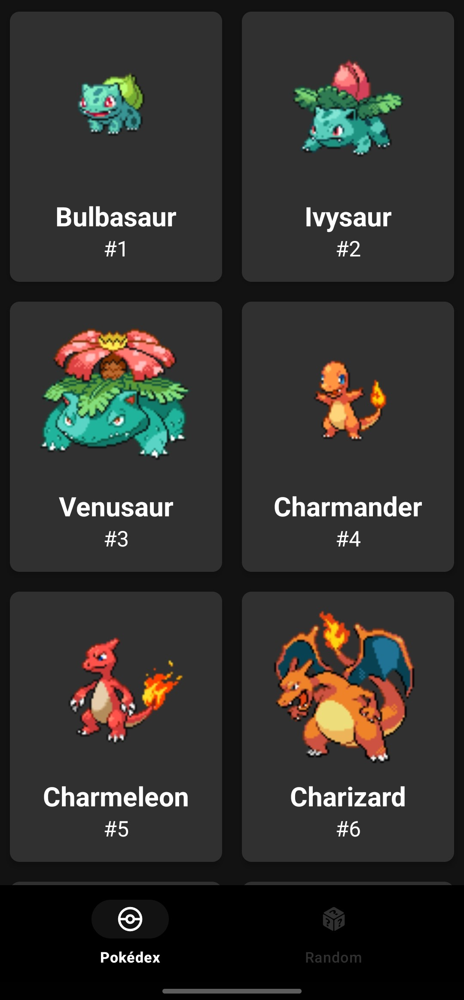

# Pokedex
An application with a Pokémon theme where I practice the main concepts of Android. 
In this app, I will apply the new knowledge and technologies I learn related to Android development and everything associated with it.

## Screenshots
| Pokédex                             | Random                            |
|-------------------------------------|-----------------------------------|
|  |  |

## Technologies Used

- Minimum SDK level 23
- [Kotlin](https://kotlinlang.org/) based
- [Coroutines](https://developer.android.com/kotlin/coroutines): Simplify asynchronous code in Kotlin.
- [Retrofit](https://github.com/square/retrofit): Streamline HTTP requests in Android.
- [Dagger Hilt](https://developer.android.com/training/dependency-injection/hilt-android): Dependency injection for Android.
- [Room](https://developer.android.com/training/data-storage/room): Local data storage in Android.
